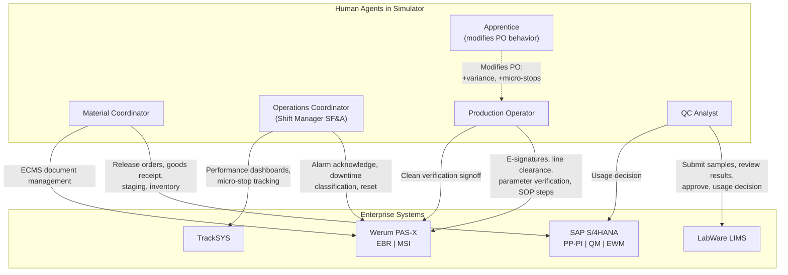
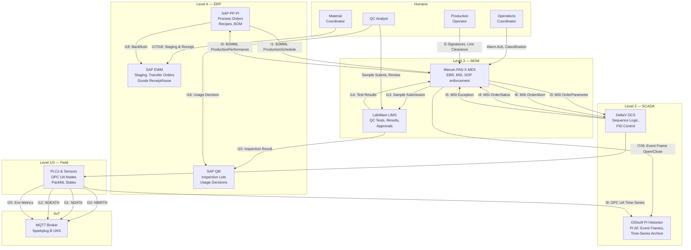
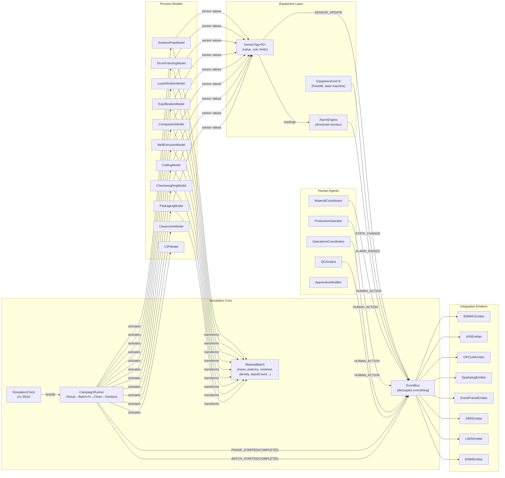

# Implementation Plan — Autonomous Pharmaceutical Manufacturing Simulator

> **Core Principle**: Zero mocked data. Every sensor reading, integration message, and business transaction is produced as a causal consequence of the simulation engine's physics models and human agent behaviors.

---

## Table of Contents
1. [Complete Process Lifecycle](#1-complete-process-lifecycle)
2. [Human Roles & System Interactions](#2-human-roles--system-interactions)
3. [Enterprise System Data Models](#3-enterprise-system-data-models)
4. [System-to-System Integration Matrix](#4-system-to-system-integration-matrix)
5. [Simulation Engine Architecture](#5-simulation-engine-architecture)
6. [Folder Structure](#6-folder-structure)
7. [Client Application](#7-client-application)
8. [Verification Plan](#8-verification-plan)

---

## 1. Complete Process Lifecycle

The simulator does not just model machines running. It models the **entire batch lifecycle** — from campaign planning through to final product release. Every phase generates data into the correct enterprise system.

### Phase A: Campaign Planning & Material Staging (Pre-Batch)

| Step | Actor | Action | System Touched | Data Produced |
|---|---|---|---|---|
| A1 | ERP (auto) | Releases Process Order for Zoladex 3.6mg campaign (3 batches) | SAP PP-PI | Process Order (order#, material, qty, BOM, routing, target dates) |
| A2 | ERP (auto) | Generates Master Recipe with operations, phases, parameters | SAP PP-PI | Master Recipe (PI-Sheets, XSteps, setpoints per stage) |
| A3 | ERP (auto) | Explodes Bill of Materials → reservation of PLGA, goserelin API, acetic acid, packaging | SAP PP-PI / MM | BOM explosion, material reservations |
| A4 | Material Coordinator | Reviews process order in ERP, triggers material staging request | SAP EWM | Staging request (bin locations, material lots, quantities) |
| A5 | EWM (auto) | Creates transfer orders → moves materials from warehouse to SPP5 staging area | SAP EWM | Transfer order (from-bin, to-bin, material, qty, lot#) |
| A6 | Material Coordinator | Performs goods receipt, scans barcodes, confirms materials at line side | SAP EWM | Goods receipt confirmation (timestamp, lot#, operator ID) |
| A7 | ERP (auto) | Creates Inspection Lot for incoming raw materials | SAP QM | Inspection lot (lot#, material, spec, test plan) |
| A8 | MES (auto) | Receives Process Order via B2MML → creates Electronic Batch Record (EBR) | PAS-X MES | EBR created (batch#, recipe steps, parameter limits) |
| A9 | Production Operator | Performs line clearance (verifies previous product removed) — signs off in MES | PAS-X MES | Line clearance record (operator ID, e-signature, timestamp) |
| A10 | MES (auto) | Sends MSI OrderParameter messages to each equipment unit (recipe setpoints) | PAS-X → PLCs | MSI OrderParameter JSON (setpoints per equipment unit) |

### Phase B: Batch Execution (9 Manufacturing Stages)

For **each of the 9 stages**, the following data operations occur:

| Step | Actor | Action | System Touched | Data Produced |
|---|---|---|---|---|
| B1 | MES (auto) | Advances EBR to next step; presents instructions to operator | PAS-X MES | EBR step transition (step#, instruction, timestamp) |
| B2 | Production Operator | Verifies critical parameters on screen, performs e-signature | PAS-X MES | E-signature record (operator ID, hash, step#, timestamp) |
| B3 | DCS/PLC (auto) | Receives setpoints from MES, begins executing sequence logic | DeltaV DCS / PLCs | Setpoint acknowledgment, sequence state |
| B4 | Equipment (auto) | Physical process runs → sensors produce real-time readings | PLCs / Sensors | OPC UA node updates (value, unit, meaning, timestamp, statusCode) |
| B5 | Historian (auto) | Opens PI Event Frame for this batch phase | OSIsoft PI | Event Frame (batchId, product, phase, startTime) |
| B6 | Historian (auto) | Continuously archives sensor time-series tagged to Event Frame | OSIsoft PI | Time-series records (tag, timestamp, value, quality) |
| B7 | MQTT (auto) | Publishes telemetry to Sparkplug B UNS topics | MQTT Broker | NDATA payloads on `spBv1.0/Macclesfield/NDATA/{edgeNode}/{device}` |
| B8 | MES (auto) | Equipment sends OrderStatus to MES on state changes | PAS-X MSI | OrderStatus JSON (equipment, state, timestamp) |
| B9 | Alarm Engine | If sensor breaches threshold → raises alarm | SCADA / MES | Alarm record (ID, severity, value, limit, timestamp) |
| B10 | Operations Coordinator | Receives alarm notification → diagnoses → acknowledges/resets | PAS-X MSI / TrackSYS | MSI Exception JSON, downtime classification, response latency |
| B11 | Historian (auto) | Closes Event Frame when phase completes, computes averages | OSIsoft PI | Event Frame closed (endTime, avgValues, minMax) |
| B12 | MaterialBatch (auto) | Stage output transforms batch properties (mass, potency, etc.) | Simulation Engine | MaterialBatch state update → feeds next stage input |

### Phase C: Inter-Batch Cleaning (CIP/SIP)

| Step | Actor | Action | System Touched | Data Produced |
|---|---|---|---|---|
| C1 | MES (auto) | Transitions equipment to PackML `Stopped` state for cleaning | PAS-X MES | OrderStatus (Stopped), EBR clean step |
| C2 | DCS (auto) | Executes CIP sequence (rinse → detergent → rinse → purified water) | DeltaV DCS | CIP sequence telemetry (flow, temp, conductivity, time) |
| C3 | Production Operator | Verifies clean completion, signs off visual inspection | PAS-X MES | E-signature on clean verification step |
| C4 | MES (auto) | Transitions back to `Idle` → ready for next batch | PAS-X MES | OrderStatus (Idle) |

### Phase D: Post-Batch Activities

| Step | Actor | Action | System Touched | Data Produced |
|---|---|---|---|---|
| D1 | QC Analyst | Submits depot samples to LIMS for offline testing | LabWare LIMS | Sample record (sample ID, batch#, test methods requested) |
| D2 | LIMS (auto) | Runs test methods: dissolution profile, assay, particle size, sterility | LabWare LIMS | Test results (method, result value, spec limits, pass/fail) |
| D3 | QC Analyst | Reviews results, approves in LIMS | LabWare LIMS | Result approval (analyst ID, e-signature, timestamp) |
| D4 | LIMS → MES | Test results cross-referenced with EBR | PAS-X / LIMS | Batch record annotated with QC results |
| D5 | MES → ERP | Sends B2MML ProductionPerformance (actual yield, material consumed) | SAP PP-PI | ProductionPerformance XML (actual qty, scrap, yield %) |
| D6 | ERP (auto) | Backflushes raw materials consumed from inventory | SAP EWM / MM | Goods issue postings (material, qty consumed, batch#) |
| D7 | QC Analyst / QA | Makes quality usage decision based on EBR + QC results | SAP QM | Usage decision (Release / Quarantine / Reject) |
| D8 | ERP (auto) | If Released: makes product available for distribution | SAP PP-PI / EWM | Finished goods receipt, warehouse putaway |

---

## 2. Human Roles & System Interactions

Every human generates **digital footprints** — badge scans, e-signatures, terminal inputs, response latencies — that the simulator must produce.

### Complete Role Matrix



### Human Agent Behavioral Models

| Role | File | Behaviors Simulated | Data Generated |
|---|---|---|---|
| **Material Coordinator** | `MaterialCoordinator.js` | Staging delay (log-normal, μ=15min), goods receipt scan (2-5min), order release review (5-10min), ECMS document check | EWM staging confirmations, goods receipt timestamps, process order release records |
| **Production Operator** | `ProductionOperator.js` | EBR step execution (reads instruction → performs → signs), line clearance (5-15min), parameter verification (30s-2min per check), clean signoff | E-signature records (operator ID, hash, step#, timestamp), line clearance records, verification records |
| **Operations Coordinator** | `OperationsCoordinator.js` | Alarm response delay (log-normal, μ=90s, σ=45s), downtime root-cause classification (selects from coded reasons: Sensor fault, Material jam, Heater failure, etc.), equipment reset | MSI Exception with classification, downtime duration, response latency metric |
| **QC Analyst** | `QCAnalyst.js` | Sample submission (triggered at batch end), result review (delay 30-120min sim-time), approval e-signature, usage decision | LIMS sample records, test results with spec comparison, approval e-signatures, QM usage decision |
| **Apprentice Modifier** | `ApprenticeModifier.js` | When toggled ON: multiplies PO step duration variance by 1.5x, increases micro-stoppage λ by 15%, introduces 5% chance of minor procedural deviation per EBR step | Deviation records in MES, extended step durations, higher alarm frequency |

---

## 3. Enterprise System Data Models

### 3A. SAP S/4HANA (Level 4 ERP)

#### PP-PI (Production Planning for Process Industries)

| Data Entity | Key Fields | When Created | When Updated |
|---|---|---|---|
| **Process Order** | `orderId`, `materialId` ("ZOLADEX-3.6MG"), `targetQty`, `uom` ("KG"), `plannedStart`, `plannedEnd`, `status` | Campaign initialization | Status changes (Released → Started → Completed) |
| **Master Recipe** | `recipeId`, `operations[]` (9 stages), per-operation: `phases[]`, per-phase: `parameters[]` (setpoint, min, max, unit) | Linked to Process Order | Static during batch |
| **Bill of Materials** | `bomId`, `components[]`: [{`materialId`: "PLGA-POLYMER", `qty`: 45, `uom`: "KG"}, {`materialId`: "GOSERELIN-API", `qty`: 0.5, `uom`: "KG"}, {`materialId`: "ACETIC-ACID", `qty`: 30, `uom`: "L"}, {`materialId`: "SYRINGE-14G", `qty`: 5000, `uom`: "EA"}, ...] | Linked to Process Order | Static |

#### QM (Quality Management)

| Data Entity | Key Fields | When Created | When Updated |
|---|---|---|---|
| **Inspection Lot** | `lotId`, `batchId`, `materialId`, `testPlan`, `status` (Created → In Test → Decision Made) | Raw material receipt + batch completion | QC results arrive, usage decision made |
| **Usage Decision** | `lotId`, `decision` (Released / Restricted / Rejected), `decisionMaker`, `timestamp`, `rationale` | Post-QC review | Final; triggers EWM goods movement |

#### EWM (Extended Warehouse Management)

| Data Entity | Key Fields | When Created | When Updated |
|---|---|---|---|
| **Staging Request** | `requestId`, `orderId`, `materials[]`, `sourceBin`, `destBin` ("SPP5-LINE-1") | Material Coordinator triggers staging | Fulfilled when transfer complete |
| **Transfer Order** | `toId`, `materialId`, `lotNumber`, `fromBin`, `toBin`, `qty`, `status` | EWM processes staging request | Confirmed by Material Coordinator barcode scan |
| **Goods Movement** | `movementType` (101=Receipt, 261=Issue, 531=Scrap), `materialId`, `qty`, `batchId`, `timestamp` | Goods receipt, backflush, scrap posting | Final |

---

### 3B. Werum PAS-X MES (Level 3)

#### Electronic Batch Record (EBR)

| Data Entity | Key Fields | When Created | When Updated |
|---|---|---|---|
| **Batch Record** | `batchId`, `orderId`, `recipeId`, `productName`, `status`, `steps[]` | Process Order received via B2MML | Every step executed |
| **EBR Step** | `stepId`, `stepType` (see below), `instruction`, `expectedValue`, `actualValue`, `operatorId`, `eSignature`, `timestamp`, `status` (Pending → Completed → Deviated) | Recipe loaded | Operator executes step |

**EBR Step Types** (the MES enforces these in sequence):
1. `LINE_CLEARANCE` — Operator confirms previous product removed
2. `MATERIAL_VERIFICATION` — Operator scans barcode of staged material, MES verifies against BOM
3. `PARAMETER_SETPOINT` — MES sends setpoint to equipment via MSI OrderParameter
4. `PROCESS_EXECUTION` — Equipment runs; MES monitors via MSI OrderStatus
5. `PARAMETER_CHECK` — Operator verifies critical in-process parameter against limits
6. `E_SIGNATURE` — Operator signs off step completion (21 CFR Part 11 compliant)
7. `SAMPLE_COLLECTION` — Operator takes sample, logs in MES, forwards to LIMS
8. `CLEAN_VERIFICATION` — Operator verifies clean completion after CIP/SIP

#### MSI Messages (4 types — bidirectional)

| Message | Direction | Trigger | Payload Fields |
|---|---|---|---|
| `OrderParameter` | MES → Equipment | Recipe step sends setpoints | `orderId`, `equipmentId`, `parameters[]` [{`name`, `value`, `unit`, `min`, `max`}] |
| `OrderStatus` | Equipment → MES | PackML state transition | `orderId`, `equipmentId`, `state` (PackML), `timestamp`, `phaseId` |
| `Exception` | Equipment → MES | Alarm raised or process deviation | `orderId`, `equipmentId`, `alarmId`, `severity`, `value`, `limit`, `description`, `timestamp` |
| `OrderAbort` | MES → Equipment | Critical failure (aseptic breach) | `orderId`, `equipmentId`, `reason`, `timestamp`, `operatorId` |

---

### 3C. LabWare LIMS (Level 3)

| Data Entity | Key Fields | When Created | When Updated |
|---|---|---|---|
| **Sample** | `sampleId`, `batchId`, `sampleType` (In-Process / Finished), `collectionTime`, `operatorId`, `status` | QC Analyst submits | Results arrive |
| **Test Method** | `methodId`, `name` (Dissolution, Assay, Particle Size, Sterility, Moisture), `specification` [{`parameter`, `min`, `max`, `unit`}] | Static config | — |
| **Test Result** | `resultId`, `sampleId`, `methodId`, `values[]` [{`parameter`, `value`, `unit`}], `passOrFail`, `analystId`, `approvalSignature`, `timestamp` | Test execution | Analyst approval |

**LIMS ↔ EBR cross-reference**: The QC results are linked back to the batch record by `batchId`. The usage decision cannot be made until all required tests pass (or deviations are documented).

---

### 3D. OSIsoft PI Historian (Level 2)

#### PI Asset Framework (PI AF) — ISA-95 Equipment Hierarchy

```
Macclesfield Campus (Enterprise)
└── SPP5 Facility (Site)
    └── Zoladex Production Line (Area)
        ├── Solution Prep Cell (Process Cell)
        │   └── Mixing Tank Unit
        │       ├── TT-101 (Temperature)
        │       ├── FT-101 (Flow Rate)
        │       ├── PT-101 (Pump Pressure)
        │       └── AT-101 (pH Analyzer)
        ├── Drum Freezing Cell
        │   └── Cryogenic Drum Unit
        │       ├── TT-201 (Drum Surface Temp)
        │       ├── ST-201 (Rotational Speed)
        │       ├── FT-201 (Feed Rate)
        │       └── VT-201 (Vibration)
        ├── Lyophilization Cell
        │   └── Freeze Dryer Unit
        │       ├── PT-301 (Chamber Vacuum)
        │       ├── TT-301 (Condenser Temp)
        │       ├── TT-302 (Shelf Temp)
        │       └── MT-301 (Sublimation Rate)
        ├── ... (continues for all 9 stages)
        └── Cleanroom Environment
            ├── PC-ENV-05 (Particle Count 0.5µm)
            ├── PC-ENV-50 (Particle Count 5.0µm)
            ├── TT-ENV (Ambient Temperature)
            └── HT-ENV (Relative Humidity)
```

Each sensor tag stores: `{ tagId, value, engineeringUnit, timestamp, quality (Good/Bad/Uncertain) }`

#### PI Event Frames

| Field | Value | Source |
|---|---|---|
| `eventFrameId` | Auto-generated UUID | Historian |
| `templateName` | "BatchPhase" | Static config |
| `batchId` | From MES | MES phase transition |
| `productName` | "Zoladex 3.6mg" | Process Order |
| `phaseName` | e.g., "Aseptic Melt Extrusion" | MES step |
| `startTime` | ISO timestamp | MES sends phase start |
| `endTime` | ISO timestamp | MES sends phase end |
| `referencedTags[]` | All sensor tags active during this phase | PI AF lookup |
| `computedValues` | `{ avgTemp, maxPressure, totalMass, ... }` | Computed at close |

**Key insight from the document**: Event Frames are what link OT data (raw sensor time-series) to IT data (which batch, which product, which phase). A downstream system queries "temperatures during Extrusion Phase of Batch 100455" — not "temperatures between 14:00 and 16:00".

---

### 3E. SCADA / DCS (Level 2)

The DCS (modeled as Emerson DeltaV) provides **automated sequence logic**. In the simulator, this is represented by the process models themselves — the DCS:
- Receives setpoints from MES via MSI OrderParameter
- Executes PID control loops (e.g., maintaining extruder zone temperatures at setpoint)
- Reports actual values back through OPC UA nodes
- Generates alarms when values breach configured limits

The DCS layer is modeled **inside each process model** as the control logic that drives sensor values toward setpoints with realistic response dynamics (overshoot, settling time, steady-state error).

---

### 3F. PLCs & OPC UA (Level 1/0)

Each equipment unit exposes an **OPC UA address space** of self-describing nodes:

```json
{
  "nodeId": "ns=2;s=SPP5.Extruder.Zone1.Temperature",
  "displayName": "Zone 1 Barrel Temperature",
  "value": 65.3,
  "engineeringUnit": "°C",
  "dataType": "Double",
  "timestamp": "2026-06-28T14:22:01.445Z",
  "statusCode": "Good",
  "sourceTimestamp": "2026-06-28T14:22:01.443Z",
  "serverTimestamp": "2026-06-28T14:22:01.445Z",
  "range": { "low": 0, "high": 120 },
  "alarmLimits": { "hiHi": 80, "hi": 75, "lo": 50, "loLo": 40 }
}
```

---

### 3G. MQTT Sparkplug B (IIoT Layer)

#### Topic Namespace
```
spBv1.0/Macclesfield/NBIRTH/ZoladexLine/SolutionPrep    → Equipment comes online
spBv1.0/Macclesfield/NDATA/ZoladexLine/SolutionPrep     → Telemetry updates
spBv1.0/Macclesfield/NDEATH/ZoladexLine/SolutionPrep    → Equipment goes offline
spBv1.0/Macclesfield/NDATA/ZoladexLine/MeltExtruder     → Extruder telemetry
spBv1.0/Macclesfield/NDATA/ZoladexLine/Cleanroom        → Environmental data
```

#### Birth Certificate (NBIRTH) — Published once when equipment comes online
```json
{
  "timestamp": 1719581000000,
  "metrics": [
    { "name": "Zone1Temperature", "dataType": "Double", "value": 22.0, "properties": { "engUnit": "°C" } },
    { "name": "Zone2Temperature", "dataType": "Double", "value": 22.0, "properties": { "engUnit": "°C" } },
    { "name": "ScrewTorque", "dataType": "Double", "value": 0.0, "properties": { "engUnit": "N·m" } },
    { "name": "DiePressure", "dataType": "Double", "value": 0.0, "properties": { "engUnit": "bar" } },
    { "name": "PackMLState", "dataType": "String", "value": "Idle" }
  ]
}
```

#### Data Message (NDATA) — Only changed values
```json
{
  "timestamp": 1719581060000,
  "metrics": [
    { "name": "Zone1Temperature", "value": 60.2 },
    { "name": "ScrewTorque", "value": 17.8 }
  ]
}
```

---

## 4. System-to-System Integration Matrix

This is the definitive map of **every data flow** between systems.

| # | From | To | Protocol | Direction | Trigger | Payload |
|---|---|---|---|---|---|---|
| I1 | SAP PP-PI | PAS-X MES | B2MML XML | ↓ Down | Process Order released | `ProductionSchedule` (order, recipe, BOM, schedule) |
| I2 | PAS-X MES | SAP PP-PI | B2MML XML | ↑ Up | Batch completed | `ProductionPerformance` (actual yield, materials consumed) |
| I3 | PAS-X MES | Equipment PLCs | MSI JSON | ↓ Down | Recipe phase starts | `OrderParameter` (setpoints for this phase) |
| I4 | Equipment PLCs | PAS-X MES | MSI JSON | ↑ Up | PackML state change | `OrderStatus` (new state, timestamp) |
| I5 | Equipment PLCs | PAS-X MES | MSI JSON | ↑ Up | Alarm condition | `Exception` (alarm details, sensor reading) |
| I6 | PAS-X MES | Equipment PLCs | MSI JSON | ↓ Down | Critical failure | `OrderAbort` (halt everything) |
| I7 | PAS-X MES | OSIsoft PI | Event Frame API | ↓ Down | Phase start | Event Frame `OPEN` (batchId, phase, startTime) |
| I8 | PAS-X MES | OSIsoft PI | Event Frame API | ↓ Down | Phase end | Event Frame `CLOSE` (endTime, computed averages) |
| I9 | Equipment PLCs | OSIsoft PI | OPC UA → PI | → Continuous | Every tick (1-10Hz) | Time-series data points (tag, value, timestamp, quality) |
| I10 | Equipment PLCs | MQTT Broker | Sparkplug B | → Continuous | Equipment boots | `NBIRTH` (full metric schema) |
| I11 | Equipment PLCs | MQTT Broker | Sparkplug B | → Continuous | Every tick | `NDATA` (changed metric values) |
| I12 | Equipment PLCs | MQTT Broker | Sparkplug B | → On failure | Equipment crash/abort | `NDEATH` (equipment offline) |
| I13 | PAS-X MES | LabWare LIMS | HTTP JSON | → On sample | Sample collection step | Sample submission (batchId, sampleType, tests) |
| I14 | LabWare LIMS | PAS-X MES | HTTP JSON | ← On result | QC tests complete | Test results (pass/fail, values, analyst signature) |
| I15 | LabWare LIMS | SAP QM | HTTP JSON | → On approval | Results approved | Inspection result (lot, pass/fail) |
| I16 | QA/QC | SAP QM | HTTP JSON | → On decision | Usage decision | Usage decision (Release/Reject, rationale) |
| I17 | SAP EWM | Material Coord. | HTTP JSON | → On staging | Process Order released | Transfer orders for material movement |
| I18 | Material Coord. | SAP EWM | HTTP JSON | ← On scan | Barcode scan at line | Goods receipt confirmation |
| I19 | SAP PP-PI | SAP EWM | Internal | ← On completion | Batch confirmed | Goods issue (backflush consumed materials) |
| I20 | Cleanroom Env. | MQTT Broker | Sparkplug B | → Continuous | Every tick | Environmental metrics (particles, temp, humidity) |



---

## 5. Simulation Engine Architecture

The `factory-simulator` is the **single source of truth**. It runs every model, every human agent, and every integration emitter.

### Internal Architecture



---

## 6. Folder Structure

```
manufacturing-plant-floor/
├── Docs/
├── package.json                            # Root: concurrently runs all 3 services
│
├── shared/
│   ├── package.json
│   ├── stages.js                           # 9-stage enum + durations + setpoints + limits
│   ├── packmlStates.js                     # PackML enum + valid transitions
│   ├── alarmCodes.js                       # Alarm registry
│   ├── equipmentHierarchy.js               # ISA-95 PI AF tree
│   ├── materials.js                        # BOM: PLGA, goserelin, acetic acid, syringes, etc.
│   ├── ebrStepTypes.js                     # EBR step type enum
│   ├── wsProtocol.js                       # WebSocket message types + schemas
│   └── units.js                            # Engineering units
│
├── factory-simulator/
│   ├── package.json
│   ├── index.js
│   └── src/
│       ├── core/
│       │   ├── SimulationClock.js
│       │   ├── MaterialBatch.js
│       │   ├── CampaignRunner.js
│       │   └── EventBus.js
│       ├── process/
│       │   ├── SolutionPrepModel.js
│       │   ├── DrumFreezingModel.js
│       │   ├── LyophilizationModel.js
│       │   ├── EquilibrationModel.js
│       │   ├── CompactionModel.js
│       │   ├── MeltExtrusionModel.js
│       │   ├── CuttingModel.js
│       │   ├── CheckweighingModel.js
│       │   ├── PackagingModel.js
│       │   ├── CleanroomModel.js
│       │   └── CIPModel.js                # CIP/SIP cleaning sequence model
│       ├── equipment/
│       │   ├── EquipmentUnit.js            # PackML state machine + sensor registry
│       │   ├── SensorTag.js                # Self-describing sensor with noise model
│       │   └── PlantFloor.js               # Instantiates all units + PI AF hierarchy
│       ├── human/
│       │   ├── MaterialCoordinator.js
│       │   ├── ProductionOperator.js       # E-sigs, line clearance, parameter checks
│       │   ├── OperationsCoordinator.js
│       │   ├── QCAnalyst.js                # Sample submission, result review, usage decision
│       │   └── ApprenticeModifier.js
│       ├── alarms/
│       │   └── AlarmEngine.js
│       └── emitters/
│           ├── B2MMLEmitter.js             # → apis POST /api/erp/*
│           ├── MSIEmitter.js               # → apis POST /api/mes/msi/*
│           ├── OPCUAEmitter.js             # → WebSocket + apis POST /api/historian/telemetry
│           ├── SparkplugEmitter.js          # → WebSocket (UNS topics)
│           ├── EventFrameEmitter.js         # → apis POST /api/historian/event-frame
│           ├── EBREmitter.js               # → apis POST /api/mes/ebr/*
│           ├── LIMSEmitter.js              # → apis POST /api/lims/*
│           └── EWMEmitter.js               # → apis POST /api/erp/ewm/*
│
├── apis/                                   # Data Recording & Query Service
│   ├── package.json
│   ├── server.js
│   └── src/
│       ├── middleware/
│       │   └── xmlParser.js
│       ├── routes/
│       │   ├── erpRoutes.js                # /api/erp/pp-pi/*, /api/erp/qm/*, /api/erp/ewm/*
│       │   ├── mesRoutes.js                # /api/mes/msi/*, /api/mes/ebr/*
│       │   ├── limsRoutes.js               # /api/lims/*
│       │   └── historianRoutes.js           # /api/historian/*
│       ├── store/
│       │   ├── BatchStore.js
│       │   ├── TelemetryStore.js
│       │   ├── AlarmStore.js
│       │   ├── MessageStore.js
│       │   ├── EventFrameStore.js
│       │   └── EBRStore.js
│       └── query/
│           └── queryController.js          # All GET endpoints for client & external consumers
│
└── client/
    ├── package.json
    ├── vite.config.js
    ├── index.html
    └── src/
        ├── main.jsx
        ├── App.jsx
        ├── styles/
        │   └── index.css
        ├── context/
        │   └── SimulationContext.jsx
        ├── hooks/
        │   ├── useSimulation.js
        │   ├── useTelemetry.js
        │   └── useBatchHistory.js
        ├── components/
        │   ├── DashboardShell.jsx
        │   ├── PlantFloorView.jsx
        │   ├── StageInspector.jsx
        │   ├── HumanOperations.jsx          # All 4 roles with interactive controls
        │   ├── MessageConsole.jsx            # Filter by system: ERP / MES / LIMS / Historian / MQTT
        │   ├── BatchRecordViewer.jsx         # Live EBR with step types and e-signatures
        │   ├── CampaignTimeline.jsx
        │   ├── EnvironmentMonitor.jsx
        │   ├── AlarmBanner.jsx
        │   ├── MaterialTracker.jsx           # MaterialBatch property evolution
        │   └── SystemTopology.jsx            # Visual map of all connected systems (ISA-95 levels)
        └── 3d/
            ├── PlantScene.jsx
            ├── ConveyorSystem.jsx
            ├── MaterialPayload.jsx
            └── machines/ (9 machine components)
```

---

## 8. Verification Plan

### Automated
1. Build all three services without errors
2. Run a full 3-batch campaign at 300x speed → verify:
   - `apis/` received exactly 1 ProductionSchedule B2MML + 3 ProductionPerformance B2MMLs
   - `apis/` received 9×3 = 27 Event Frame open/close pairs
   - `apis/` received 9×3 = 27 MSI OrderParameter + OrderStatus sequences
   - `apis/` received EBR steps with e-signatures for each phase
   - `apis/` received LIMS QC results for each batch
   - `apis/` received QM usage decisions for each batch
   - `apis/` received EWM staging confirmations and goods movements
   - MaterialBatch final yield is mathematically consistent with checkweigh accept/reject counts

### Manual
1. `npm run dev` → all 3 services boot
2. Open `http://localhost:5173`:
   - 3D scene renders all machines and conveyor system
   - Campaign timeline shows Setup → Batch 1 → Clean → Batch 2 → ...
   - MaterialTracker shows mass/potency evolving through stages
   - HumanOperations panel shows all 4 roles with live activity
   - MessageConsole can filter by system (ERP, MES, LIMS, Historian, MQTT)
   - BatchRecordViewer shows EBR steps being executed with e-signatures
   - Injecting faults cascades through: alarm → MSI Exception → downstream quality impact → yield change → B2MML reports lower output
