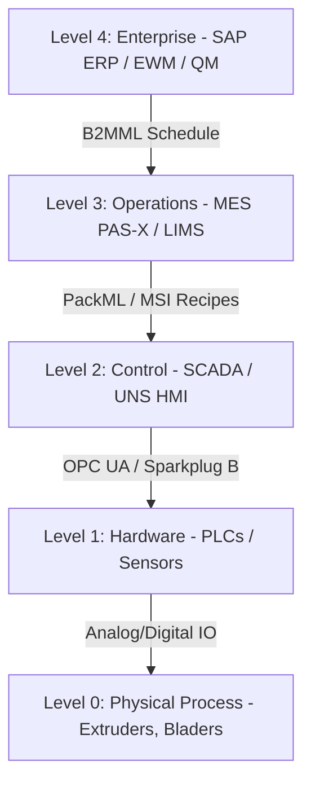
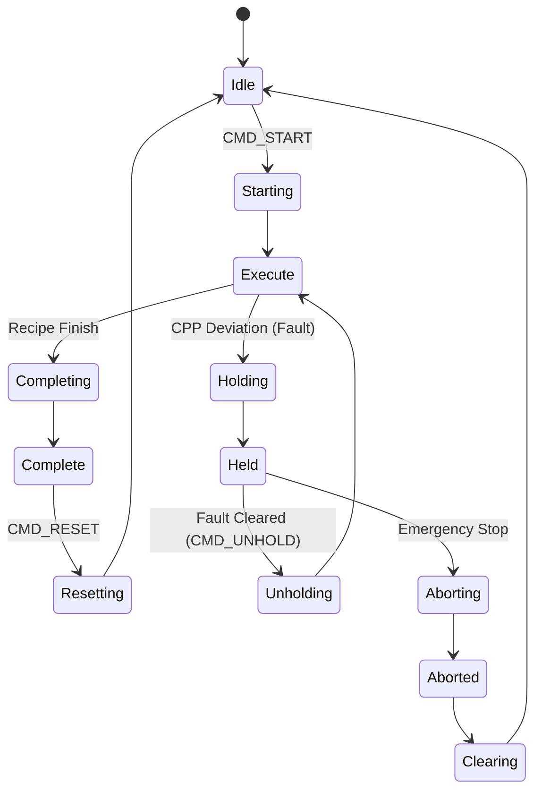

# Onboarding Guide: Software Engineering in Autonomous Manufacturing

Welcome to the **Zoladex SPP5 PLGA Extrusion Line** project. This guide is designed to onboard software engineers entering the cyber-physical domain. It bridges the gap between pure software design patterns and physical engineering constraints, explaining how to communicate and collaborate effectively with **Process Engineers**, **Asset/Equipment Engineers**, and **Subject Matter Experts (SMEs)**.

---

## 1. The ISA-95 Enterprise-to-Automation Stack

Manufacturing software architecture is standardized by the **ISA-95** framework, which divides systems into logical layers. As a software engineer, you will write APIs and visual systems that interface across all these layers.

### Level 4: Enterprise Systems (ERP, EWM, QM)
*   **ERP (Enterprise Resource Planning - SAP)**: Tracks the business ledger. It schedules what product to make, releases master batch orders, and settles final raw material/labor costs.
*   **EWM (Extended Warehouse Management)**: Manages physical warehouse inventory. It stages raw ingredients (PLGA polymer, active drug powder, syringe parts) to the cleanroom loading bay.
*   **QM (Quality Management)**: Processes quality lab test releases, issuing final usage decisions to ship the product or quarantine the lot.

### Level 3: Operational Systems (MES, LIMS, EBR)
*   **MES (Manufacturing Execution System - Werum PAS-X)**: The execution brain. It translates Level 4 orders into structured shop floor actions, guiding operators through line clearances, sanitization checklists, and equipment runs.
*   **EBR (Electronic Batch Record)**: A digital, compliance-validated log (conforming to FDA 21 CFR Part 11). It records process parameters and operator badge sign-offs, creating a legally binding record that the batch was made safely.
*   **LIMS (Laboratory Information Management System - LabWare)**: The laboratory portal. It tracks syringe samples sent for physical and chemical testing, returning potency and sterility approvals.

### Level 2: Supervisory Control (SCADA, HMI, UNS)
*   **SCADA (Supervisory Control and Data Acquisition)**: Orchestrates real-time control, alarm aggregation, and equipment interlocking.
*   **UNS (Unified Namespace)**: A centralized data broker architecture (using MQTT and Sparkplug B) where SCADA publishes continuous sensor feeds in a flat, logical path structure.

### Level 1 & 0: Automation & Physics (PLCs, Sensors, Hardware)
*   **PLC (Programmable Logic Controller)**: Industrial computers running real-time scan loops to read analog/digital IO from sensors (heaters, vacuum transducers, load cells) and command actuators (VFD motors, solenoid valves).
*   **Physical Process**: The melting, extrusion, freezing, and cutting of polymer drug implants.

---

## 2. Process Engineering & Physics-Driven Telemetry
Process Engineers and Chemists focus on **CPPs (Critical Process Parameters)** and **CQAs (Critical Quality Attributes)**. If a CPP drifts out of its statistical control limit, it degrades the CQA, resulting in rejected medicine batches.

Here is a breakdown of the 9 stages on the SPP5 line, mapping what happens to the software parameters you will work with:

| Stage | Process Engineering Goal | Critical Process Parameters (CPPs) | Critical Quality Attributes (CQAs) | Failure Impact (SME Context) |
|---|---|---|---|---|
| **1. Solution Prep** | Dissolve Goserelin active drug and PLGA polymer carrier in solvent. | Stirring Speed (RPM), Dissolution Temp (°C) | Concentration Homogeneity (%) | Incomplete dissolution leads to uneven drug dosage distribution. |
| **2. Drum Freezing** | Cryogenically freeze liquid solution into thin solid flakes. | Drum Temp (°C, nom. -60°C), Rotation Speed | Crystallization Density (g/cm³) | Slow freezing causes the drug molecules to separate out of the polymer. |
| **3. Lyophilization** | Freeze-dry flakes under deep vacuum to evaporate solvent. | Chamber Pressure (mbar), Heater Shelf Temp | Moisture Content (%), Cake Porosity | Vacuum loss melts the frozen flakes, ruining structural matrix stability. |
| **4. Equilibration** | Let dry powder absorb minor moisture to relax polymer chains. | Chamber Humidity (% RH), Exposure Time | Glass Transition Temp (Tg, °C) | Brittle polymer cracks during compaction; too wet degrades active drug. |
| **5. Compaction** | Compress dry powder into dense, solid drug cylinders. | Cylinder Piston Load (kN) | Solid Density, Compaction Diameter | Under-compaction traps air bubbles, leading to thin spots during extrusion. |
| **6. Melt Extrusion** | Heat and push polymer cylinders through micro-orifice die. | Zone 1-3 Heaters (°C), Extruder Screw Torque | Filament Diameter (1.0mm), Potency | High heat triggers **Arrhenius thermal degradation**, destroying the active API. |
| **7. Cutting** | Slicing continuous drug filament into individual doses. | Blade Speed (Hz), Filament Feed Rate | Depot Implant Length (mm), Mass | Lag in blade speed results in short or long depots, causing dosing errors. |
| **8. Checkweighing** | Weigh 100% of sliced depots on high-speed micro-gram scales. | Scale Calibration, Reject Blower Pressure | Statistical Weight Control (3.6mg ±10%) | Out-of-spec implants must be blown into the reject bin instantly. |
| **9. Packaging** | Seal implant depots inside syringes and moisture-proof foil pouches. | Sealer Head Temp (°C), Seal Dwell Time | Package Seal Integrity (Leak Test) | A bad seal allows humidity to enter, causing PLGA hydrolysis degradation. |

### Arrhenius Thermal Degradation (SME Chemistry Insight)
When working on the Melt Extruder control code, keep in mind that the active pharmaceutical ingredient (Goserelin) degrades exponentially with heat according to the Arrhenius law:
$$k = A e^{-\frac{E_a}{R T}}$$
Process engineers require software safeguards (interlocks) that immediately hold the line if the extrusion temperature exceeds **75°C** for more than **10 seconds**, as thermal degradation permanently alters the drug potency.

---

## 3. Asset Engineering & PackML States
Asset Engineers design and maintain the physical machines. To talk to them, you must understand the **PackML (Packaging Machine Language / ISA-88)** standard. PackML defines a universal state machine running on every PLC, allowing different vendor systems to synchronize.

### Key Software Implications:
1.  **Polling vs State Notifications**: Do not poll PLCs continuously. Rather, subscribe to the PackML state tag. When the state shifts to `Holding`, trigger visual banner alerts immediately.
2.  **State-Driven Animations**: In the Three.js 3D view, machine animations (extruders turning, cutters rotating) are linked directly to the PackML state. An asset is only physically moving when its state is `Execute` or `Starting`.

---

## 4. Software Data Protocols & UNS Flow

In an autonomous factory, data passes through standard formats and centralized networks:

### B2MML (Business to Manufacturing Markup Language)
An XML implementation of the ISA-95 standard. It represents the communication boundary between Level 4 enterprise systems and Level 3 execution systems.
*   **ProductionSchedule XML**: Sent from SAP ERP to Werum MES. Contains the process order ID, material lot definitions, and target yields.
*   **ProductionPerformance XML**: Sent from MES back to ERP when the batch completes. Reports actual yield quantity, scrap count, raw materials consumed, and operator hours for accounting settlement.

### UNS (Unified Namespace)
Historically, factories used complex point-to-point connections (SCADA to database, database to MES, MES to ERP). In SPP5, we use a **Unified Namespace (UNS)**.
*   **Architecture**: A centralized MQTT broker where every sensor, PLC, and enterprise software publishes and subscribes to data in a logical folder hierarchy.
*   **Topic Path Structure**:
    `site / area / line / cell / asset / tag`
    *Example*: `Macclesfield/SPP5/ExtrusionLine/Extruder/Sensors/Zone1Temp`
*   **Sparkplug B**: A payload standard wrapper for MQTT that adds timestamps, metric metadata, and sequence numbers, ensuring message delivery integrity.

---

## 5. Working with SMEs: Collaboration Tips
To build successful software on this line, keep these guidelines in mind:
*   **Process Physics are Physical Laws, Not Code Bugs**: If a process engineer says the compaction force is dropping due to polymer moisture content, do not suggest adjusting the code scale factors. The physical material properties are shifting. The software must report this accurately so the operator can inspect the dehumidifiers.
*   **Respect Interlocks**: An "interlock" is a software command that shuts down a machine for safety. Never bypass or override interlocks in code without consulting the Asset Engineer. Overriding a temperature interlock can cause permanent damage to an extruder barrel or trigger a fire.
*   **FDA Validation (GxP)**: Manufacturing code is subject to strict regulatory validation. Once software is approved, changes require rigorous document approvals. Design modular configurations so parameters (like alarm limits or target weights) can be modified via databases and recipes without needing to recompile and revalidate the core codebase.
